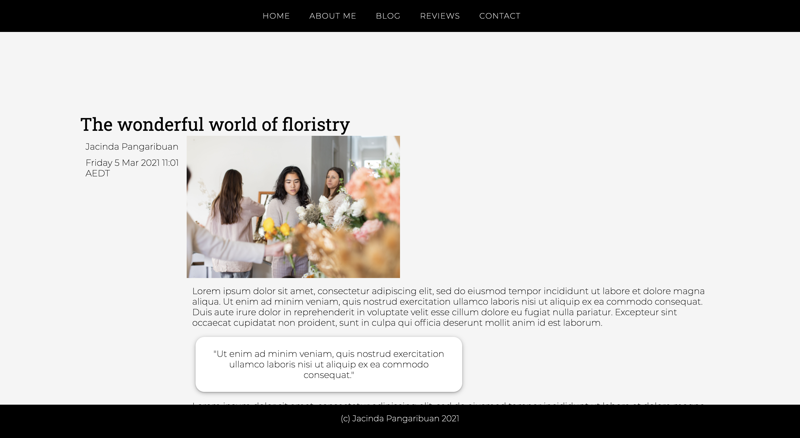

# Portfolio Documentation
## Portfolio URL
Click [here]() to see the website.

## Portfoilo Ed Workspace
Click [here](https://edstem.org/courses/4965/workspaces/ppTn26hkW47PemwZvHR2UzeWp5FhrZBR) to see my workspace.

## Website Description
### Purpose
The purpose of the project is to showcase my coding abilities and professional skills to a prospective employer. I have employed my HTML and CSS skills to create a portfolio website that includes a short biography, my resume, blog posts, reviews from past employers and contact details.

### Functionality/Features
The functional components featured are:
* Responsive design
* Navigation bar
* Consistent styling
* Blog posts
* Reviews Page
* Social media links

#### Responsive design
Responsive design allows for . The Flexbox model allows this website to be viewed on different screen sizes.

#### Navigation bar
A navigation bar serves a pivotal function in this website. It allows users to access information in different webpages. The navigation bar in this website can be found on the top of every page for easy access. It's simple design and large font allows for clear and easy navigation.

#### Consistent styling
Consistent styling creates a page flow that establishes my brand. The typography (font, size and structure), design elements and photo choices are themed to make this design coherent.

#### Blog posts
The Reviews page showcases real life people w

#### Reviews page
The Reviews page showcases real life people w

#### Social media links
In addition to the classic navigation menu that has links to internal pages, I have also included links that direct users to external websites. For example, I have made the GitHub icon on the "Technical Skills" page a hyperlink, so the users can check out my projects on GitHub.

### Sitemap

### Screenshots

### Target Audience
The target audience of the portfolio website is a prospective employer looking to engage a developer.

### Tech Stack
The Tech Stack used are HTML and CSS.
The deployment platform used is Netlify.